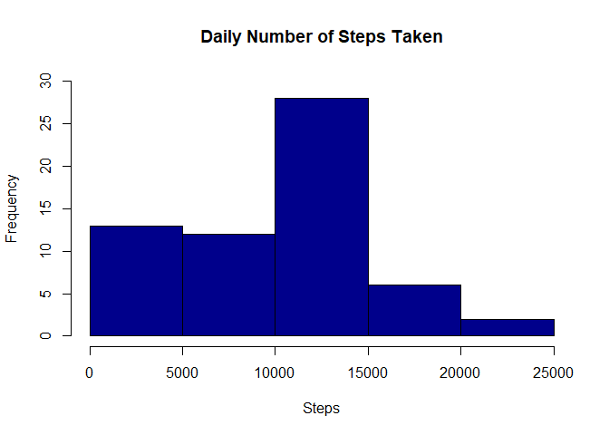
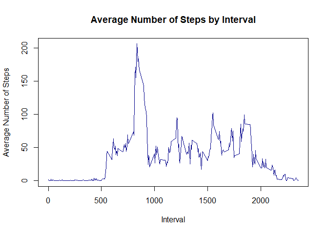
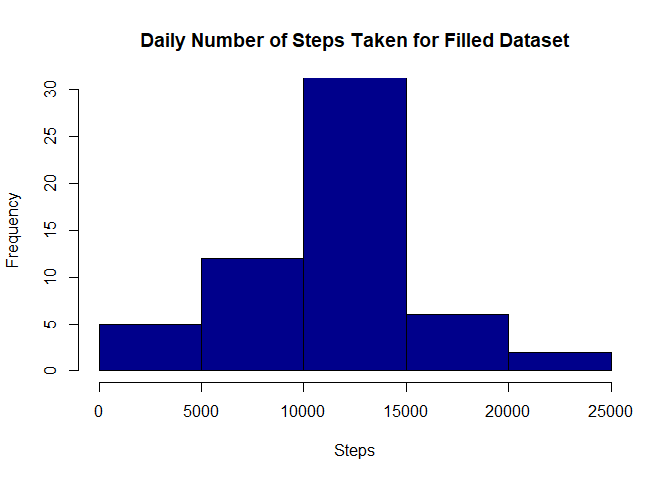
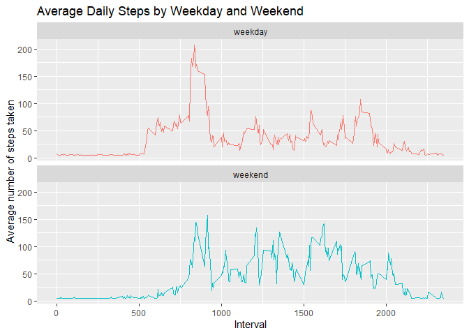

## Loading and preprocessing the data

1. Load the data


```r
library(ggplot2)
```

```
## Warning: package 'ggplot2' was built under R version 4.0.2
```

```r
#load data
activity <- read.csv('activity.csv')
```

2. Process and transform character data into date format

```r
#convert to string to date
activity$date <- as.Date(activity$date, '%Y-%m-%d')

str(activity)
```

```
## 'data.frame':	17568 obs. of  3 variables:
##  $ steps   : int  NA NA NA NA NA NA NA NA NA NA ...
##  $ date    : Date, format: "2012-10-01" "2012-10-01" ...
##  $ interval: int  0 5 10 15 20 25 30 35 40 45 ...
```

## What is mean total number of steps taken per day?

1. Histogram of the total number of steps taken each day


```r
daily_number_steps <- with(activity, aggregate(steps, by = list(date), FUN = sum, na.rm = TRUE ))
names(daily_number_steps) <- c('date', 'steps')
hist(daily_number_steps$steps, main = 'Daily Number of Steps Taken', xlab = 'Steps', col = 'darkblue', ylim = c(0, 30))
```

<!-- -->

2. Calculate and report the mean and median total number of steps taken per day


```r
summary(daily_number_steps$steps)
```

```
##    Min. 1st Qu.  Median    Mean 3rd Qu.    Max. 
##       0    6778   10395    9354   12811   21194
```

According to the above result, mean of daily steps is 9354, and the median of daily steps is 10395

## What is the average daily activity pattern?

1. Make time series plot (i.e. type = 'l') of the 5-minute interval (x-axis) and the average number of steps taken, averaged across all days (y-axis)

```r
average_number_steps <- aggregate(activity$steps, by = list(activity$interval), FUN = mean, na.rm = TRUE)
names(average_number_steps) <- c('interval', 'mean')
plot(average_number_steps$interval, average_number_steps$mean, type = 'l', col = 'darkblue', main = 'Average Number of Steps by Interval', xlab = 'Interval', ylab = 'Average Number of Steps' )
```

<!-- -->

2. Which 5-minute interval, on average across all the days in the dataset, contains the maximum number of steps?


```r
max_5_minute_interval = average_number_steps[which.max(average_number_steps$mean), ]$interval
print(max_5_minute_interval)
```

```
## [1] 835
```
The 5-minute interval contains the maximum number of steps is 835.

## Imputing missing values

1. Calculate and report the total number of missing values in the dataset (i.e. the total number of rows with NA)


```r
colSums(is.na(activity))
```

```
##    steps     date interval 
##     2304        0        0
```
There are 2304 missing records in the dataset.

2.Devise a strategy for filling in all of the missing values in the dataset. The strategy does not need to be sophisticated. For example, you could use the mean/median for that day, or the mean for that 5-minute interval, etc.

The strategy for filling in all of the mission values in the dataset is to use the value of the mean of steps per 5-minute interval.


```r
filled_value <- mean(activity$steps, na.rm = TRUE)
print(filled_value)
```

```
## [1] 37.3826
```
The filling value will be 37.38.

3. Create a new dataset that is equal to the original dataset but with the missing data filled in.


```r
filled_activity <- activity
filled_activity[is.na(filled_activity$steps), ]$steps <- filled_value

str(filled_activity)
```

```
## 'data.frame':	17568 obs. of  3 variables:
##  $ steps   : num  37.4 37.4 37.4 37.4 37.4 ...
##  $ date    : Date, format: "2012-10-01" "2012-10-01" ...
##  $ interval: int  0 5 10 15 20 25 30 35 40 45 ...
```

The is no mission value in the new dataset.

```r
colSums(is.na(filled_activity))
```

```
##    steps     date interval 
##        0        0        0
```

4. Make a histogram of the total number of steps taken each day and Calculate and report the mean and median total number of steps taken per day. Do these values differ from the estimates from the first part of the assignment? What is the impact of imputing missing data on the estimates of the total daily number of steps?

* Histogram of the total number of steps taken each day on the filled dataset.


```r
filled_daily_number_steps <- with(filled_activity, aggregate(steps, by = list(date), FUN = sum, na.rm = TRUE))
names(filled_daily_number_steps) <- c('date', 'steps')
hist(filled_daily_number_steps$steps, main = 'Daily Number of Steps Taken for Filled Dataset', xlab = 'Steps', col = 'darkblue', ylim = c(0, 30))
```

<!-- -->

* Finding the mean and media total number of steps taken per day for the filled dataset.


```r
summary(filled_daily_number_steps$steps)
```

```
##    Min. 1st Qu.  Median    Mean 3rd Qu.    Max. 
##      41    9819   10766   10766   12811   21194
```

The mean of total number of steps taken per day in the filled dataset is 1.0766\times 10^{4}, while the median is 1.0766\times 10^{4}.

* It is shown that there is a difference between the first and second estimates (filled na). The mean and median of the first estimate are 9354 and 1.0395\times 10^{4}, respectively; while the second estimates (filled na) are 1.0766\times 10^{4} and 1.0766\times 10^{4}, respectively. The difference between first and second estimates in terms of mean and median are 1412 and 371, respectively.

## Are there differences in activity patterns between weekdays and weekends?
1. Create a new factor variable in the dataset with two levels -- "weekday" and "weekend" indicating whether a given date is a weekday or weekend day.


```r
filled_activity$weekday <- ifelse (weekdays(filled_activity$date) == 'Saturday' | weekdays(filled_activity$date) == 'Sunday', 'weekend', 'weekday')
filled_activity$weekday <- as.factor(filled_activity$weekday)

str(filled_activity)
```

```
## 'data.frame':	17568 obs. of  4 variables:
##  $ steps   : num  37.4 37.4 37.4 37.4 37.4 ...
##  $ date    : Date, format: "2012-10-01" "2012-10-01" ...
##  $ interval: int  0 5 10 15 20 25 30 35 40 45 ...
##  $ weekday : Factor w/ 2 levels "weekday","weekend": 1 1 1 1 1 1 1 1 1 1 ...
```

```r
head(filled_activity)
```

```
##     steps       date interval weekday
## 1 37.3826 2012-10-01        0 weekday
## 2 37.3826 2012-10-01        5 weekday
## 3 37.3826 2012-10-01       10 weekday
## 4 37.3826 2012-10-01       15 weekday
## 5 37.3826 2012-10-01       20 weekday
## 6 37.3826 2012-10-01       25 weekday
```

2. Make a panel plot containing a time series plot (i.e. type = "l") of the 5-minute interval (x-axis) and the average number of steps taken, averaged across all weekday days or weekend days (y-axis). 


```r
activity_by_weekday <- aggregate(steps~interval+weekday,filled_activity, mean, na.rm = TRUE)
plot <- ggplot(activity_by_weekday, aes(x = interval, y = steps, color = weekday)) + geom_line(show.legend = FALSE) + labs(title = 'Average Daily Steps by Weekday and Weekend', x = 'Interval', y ='Average number of steps taken') + facet_wrap(~weekday, ncol=1, nrow=2)
print(plot)
```

<!-- -->
